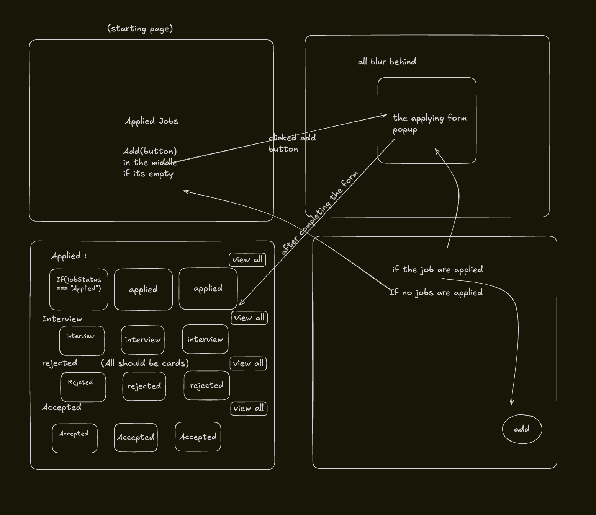
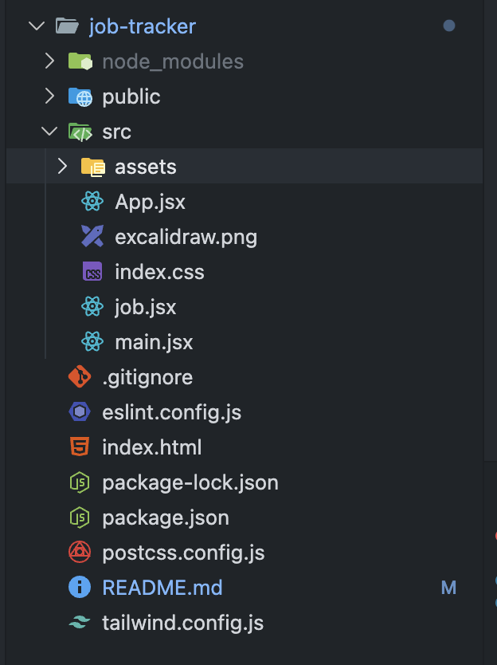

# 🌳 Career Garden

A beautiful, nature-themed job application tracker that helps you nurture your career growth. Watch your job applications grow from seeds 🌱 to full trees 🌳!

## ✨ Features

### 🎨 Beautiful Garden Theme
- **Seedling (Applied)** 🌱 - Just planted your application
- **Sprouting (Interview)** 🌿 - Growing and progressing
- **Bloomed (Accepted)** 🌳 - Success! Your tree is fully grown
- **Withered (Rejected)** 🍂 - Didn't make it this time

### 🔐 Secure Authentication
- Google OAuth 2.0 integration
- Personalized greetings with user's first name
- Session persistence across visits

### 📊 Smart Organization
- Automatically categorized by status
- Sortable by date
- Expandable sections for better view
- Mobile-responsive grid layout

### 💾 Data Persistence
- LocalStorage for reliable data saving
- User-specific job tracking
- Edit and delete functionality
- Optional notes for each application

### 📱 Fully Responsive
- Works seamlessly on mobile, tablet, and desktop
- Touch-friendly interface
- Adaptive grid (2 columns mobile → 5 columns desktop)

## 🚀 Getting Started

### Prerequisites
- Node.js (v14 or higher)
- npm or yarn
- Google Cloud Project with OAuth 2.0 credentials

### Installation

1. **Clone the repository**
```bash
git clone https://github.com/imranrkhan13/career-garden.git
cd career-garden
```

2. **Install dependencies**
```bash
npm install
# or
yarn install
```

3. **Install required packages**
```bash
npm install @react-oauth/google jwt-decode
```

4. **Set up Google OAuth**
   - Go to [Google Cloud Console](https://console.cloud.google.com/)
   - Create a new project or select existing one
   - Enable Google+ API
   - Create OAuth 2.0 credentials
   - Add authorized origins (e.g., `http://localhost:5173`)
   - Copy your Client ID

5. **Configure the app**

Open `src/main.jsx` and wrap your App with GoogleOAuthProvider:

```jsx
import { GoogleOAuthProvider } from '@react-oauth/google';

ReactDOM.createRoot(document.getElementById('root')).render(
  <React.StrictMode>
    <GoogleOAuthProvider clientId="YOUR_GOOGLE_CLIENT_ID_HERE">
      <App />
    </GoogleOAuthProvider>
  </React.StrictMode>
);
```

6. **Run the development server**
```bash
npm run dev
# or
yarn dev
```

7. **Open your browser**
Navigate to `http://localhost:3000`

## 🎯 Usage

### Adding a Job Application
1. Click the floating 🌱 button (bottom-right)
2. Fill in the form:
   - **Company** (required)
   - **Role** (required)
   - **Growth Stage** (Applied/Interview/Rejected/Accepted)
   - **Date Planted** (required)
   - **Garden Notes** (optional)
3. Click "🌱 Plant" to save

### Managing Applications
- **Edit**: Click "✏️ Tend" on any card
- **Delete**: Click "🗑️" on any card
- **View All**: Click "View all" when section has 5+ items
- **Sign Out**: Click "Sign out" button in header

### Understanding the Garden
- **Applied** 🌱: Recently submitted applications
- **Interview** 🌿: Applications in interview stage
- **Accepted** 🌳: Successful applications
- **Rejected** 🍂: Unsuccessful applications

## 🗺️ User Flow & Architecture



## 🛠️ Tech Stack

- **React 18** - Frontend framework
- **Vite** - Build tool and dev server
- **Tailwind CSS** - Styling
- **Google OAuth** - Authentication
- **LocalStorage** - Data persistence

## 📁 Project Structure



## 🎨 Components

### Main Components
- **EmptyState** - Welcome screen when no jobs added
- **LoginScreen** - Google OAuth login page
- **JobCard** - Individual job application card
- **JobSection** - Categorized job sections
- **JobModal** - Add/Edit job form

### Key Features
- Responsive design with Tailwind CSS
- Animated transitions and hover effects
- Form validation
- Confirm dialogs for destructive actions

## 🔒 Data Storage

Jobs are stored in browser's localStorage:
- **Key format**: `career_garden_jobs_{userId}`
- **Data structure**: Array of job objects
- **User session**: `career_garden_user`

### Job Object Schema
```javascript
{
  id: number,
  company: string,
  role: string,
  status: "Applied" | "Interview" | "Rejected" | "Accepted",
  date: string (YYYY-MM-DD),
  notes?: string
}
```

## 🚧 Known Limitations

- Data stored locally (no cloud sync)
- Single user per browser
- No export/import functionality (yet!)
- Browser storage size limits (~5-10MB)

## 🔮 Future Enhancements
- [ ] **Cloud Sync** - Firebase/Supabase integration for cross-device access
- [ ] **Export Tools** - Download your garden as CSV/PDF
- [ ] **Smart Reminders** - Email notifications for follow-ups
- [ ] **Timeline View** - See your applications on a calendar
- [ ] **Dark Mode** - For late-night application sessions
- [ ] **Company Intel** - Integrated research and notes
- [ ] **Interview Prep** - Built-in preparation checklists
- [ ] **Garden Themes** - Customize your garden aesthetic

## 🤝 Contributing

Contributions are welcome! I'd love to see what you'd add to the garden.
